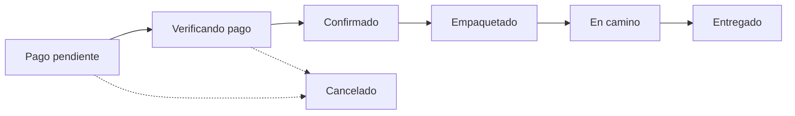

# Manual de Administrador

## 1. Introducción

Este manual describe las funciones administrativas reales del sistema Akitukuymi, disponibles únicamente para las cuentas con rol *administrador*. El panel de administración permite gestionar el catálogo (productos, categorías y lanas), verificar pagos y dar seguimiento a los pedidos, así como administrar los roles de los usuarios. La documentación se limita a los módulos efectivamente implementados en el proyecto; no se describen funciones inexistentes.

## 2. Acceso al panel de administración

El panel se encuentra en la ruta `/admin` y está protegido por doble control: la sesión debe estar iniciada (control de autenticación) y la cuenta debe tener el rol *administrador* (control de rol). Un usuario sin estos requisitos es redirigido automáticamente a la página de inicio.

### 2.1. Asignación del rol administrador

Por seguridad, ningún usuario puede autoasignarse el rol de administrador desde la interfaz. El primer administrador se define directamente en la base de datos (Supabase), ejecutando la siguiente instrucción en el editor SQL, reemplazando el correo por el de la cuenta correspondiente:

```sql
update public.perfiles set rol = 'admin' where email = 'correo@ejemplo.com';
```

Una vez asignado el primer administrador, este puede otorgar o retirar el rol a otros usuarios desde el módulo *Usuarios*, sin necesidad de volver a la base de datos.

**Figura 9.**

*Menú del usuario administrador con el acceso al Panel de administración.*

[INSERTAR CAPTURA del menú desplegable de la cuenta con la opción "Panel de administración"]

*Fuente:* Elaboración propia.

## 3. Estructura del panel

El panel de administración cuenta con una barra lateral de navegación que da acceso a seis secciones. La barra incluye además el acceso "Ver la tienda" y "Cerrar sesión".

**Tabla 3**

*Secciones del panel de administración*

| Sección | Ruta | Función principal |
|---------|------|-------------------|
| Dashboard | `/admin` | Resumen de indicadores y alertas de inventario. |
| Pedidos | `/admin/pedidos` | Verificación de pagos y cambio de estado de pedidos. |
| Productos | `/admin/productos` | Alta, edición y baja de productos. |
| Categorías | `/admin/categorias` | Alta, edición y baja de categorías. |
| Lanas | `/admin/lanas` | Gestión de lanas e hilos. |
| Usuarios | `/admin/usuarios` | Consulta de usuarios y cambio de rol. |

*Nota.* Todas las secciones se cargan de forma diferida (lazy loading) para optimizar el rendimiento. Elaboración propia.

## 4. Dashboard

El *Dashboard* presenta cuatro tarjetas de resumen y dos paneles complementarios. Las tarjetas muestran:

- **Ventas confirmadas:** suma de los montos de los pedidos en estado confirmado, empaquetado, en camino o entregado.
- **Pagos por verificar:** cantidad de pedidos con comprobante subido pendiente de revisión.
- **Pedidos en proceso:** pedidos confirmados, empaquetados o en camino.
- **Stock bajo:** número de productos con tres unidades o menos.

Los paneles inferiores muestran los últimos pedidos registrados y la lista de productos con stock bajo.

**Figura 10.**

*Dashboard del panel de administración con las tarjetas de resumen.*

[INSERTAR CAPTURA de la ruta `/admin`]

*Fuente:* Elaboración propia.

## 5. Gestión de pedidos y verificación de pagos

El módulo *Pedidos* es el núcleo operativo del negocio. Presenta la lista de pedidos con filtros por estado y, al abrir un pedido, muestra un panel lateral con el detalle completo: datos de contacto y entrega, comprobante de pago con su número de operación, productos, total e historial de cambios de estado.

### 5.1. Flujo de verificación

El administrador revisa el comprobante de Yape adjunto y, si el pago es correcto, avanza el pedido de estado. El flujo natural del pedido es el siguiente:



Cada cambio de estado queda registrado en el historial del pedido con su fecha. El estado *Cancelado* puede aplicarse cuando el pago no procede.

**Figura 11.**

*Detalle de un pedido en el panel de administración con el comprobante de pago.*

[INSERTAR CAPTURA del panel lateral de detalle en `/admin/pedidos`]

*Fuente:* Elaboración propia.

## 6. Gestión de productos

El módulo *Productos* permite crear, editar, eliminar y ocultar productos. El formulario de producto incluye nombre, descripción, categoría, precio, precio de oferta (opcional), stock, imagen, la marca de producto destacado y la visibilidad en la tienda. La imagen se sube al almacenamiento del sistema y se asocia al producto. Los productos con tres unidades o menos se resaltan como stock bajo; los que tienen cero unidades aparecen como agotados.

**Figura 12.**

*Listado de productos con las acciones de edición y eliminación.*

[INSERTAR CAPTURA de la ruta `/admin/productos`]

*Fuente:* Elaboración propia.

## 7. Gestión de categorías

El módulo *Categorías* permite administrar las categorías del catálogo (nombre, descripción, imagen y visibilidad). Cada categoría muestra la cantidad de productos asociados. La eliminación de una categoría deja sin categoría a los productos que la tenían asignada, por lo que se recomienda precaución.

## 8. Gestión de lanas

El módulo *Lanas* administra la venta de lanas e hilos. Cada lana registra nombre, color, precio por unidad, precio por paquete, unidades por paquete, stock y visibilidad. Esta información alimenta la tabla de precios de lanas que se muestra en la página de inicio y que también consulta el asistente virtual.

## 9. Gestión de usuarios

El módulo *Usuarios* muestra la lista de personas registradas con su nombre, correo, teléfono, fecha de registro y rol. Permite buscar por nombre o correo y cambiar el rol de un usuario entre *cliente* y *administrador*. La propia cuenta del administrador en sesión no puede modificar su propio rol desde esta pantalla.

**Nota sobre privacidad:** el panel muestra los datos de contacto de los clientes con fines exclusivamente operativos (atención, coordinación de envíos y verificación de pagos). El sistema nunca expone contraseñas, ya que estas se almacenan cifradas en el servicio de autenticación y no son recuperables.

**Figura 13.**

*Módulo de usuarios con la acción de cambio de rol.*

[INSERTAR CAPTURA de la ruta `/admin/usuarios`]

*Fuente:* Elaboración propia.

## 10. Modo demostración (solo lectura)

El sistema incorpora un *modo demostración* controlado por la propiedad `soloLectura` en la configuración del entorno. Cuando está activo, cualquier persona puede navegar, iniciar sesión y probar el asistente, pero todas las operaciones de escritura (crear, editar o eliminar productos, categorías, lanas, pedidos, direcciones o cambios de rol) quedan bloqueadas y muestran un aviso. Este modo es útil para compartir la plataforma con evaluadores sin riesgo de alteración de datos. La protección se refuerza opcionalmente a nivel de base de datos mediante un script SQL que retira los permisos de escritura.

## 11. Buenas prácticas administrativas

- Verificar cuidadosamente cada comprobante de Yape antes de confirmar un pedido.
- Mantener el stock actualizado para evitar ventas de productos agotados.
- Utilizar la visibilidad ("ocultar") en lugar de eliminar cuando un producto sea temporal.
- Emplear una contraseña robusta en las cuentas de administrador antes de difundir la plataforma.

## 12. Referencias

Supabase. (2024). *Supabase documentation: Auth and Row Level Security*. https://supabase.com/docs

n8n. (2024). *n8n documentation*. https://docs.n8n.io
