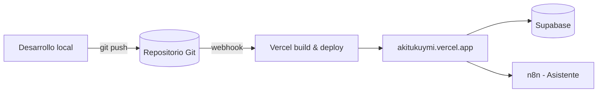

# Manual de Instalación y Despliegue

## 1. Introducción

Este manual describe el procedimiento real para instalar, ejecutar en entorno local y desplegar en producción el sistema Akitukuymi. Todos los comandos utilizan **pnpm** como gestor de paquetes; no se emplea npm. El proyecto está construido con Angular 22 con renderizado del lado del servidor (SSR) y se despliega en la plataforma Vercel a partir de un repositorio Git.

## 2. Requisitos previos

**Tabla 4**

*Requisitos del entorno de desarrollo*

| Componente | Versión / condición | Uso |
|------------|--------------------|-----|
| Node.js | 20 LTS o superior | Entorno de ejecución de JavaScript. |
| pnpm | 10.15.0 (declarado en el proyecto) | Gestor de paquetes. |
| Git | Cualquier versión reciente | Control de versiones y despliegue. |
| Cuenta de Supabase | — | Base de datos, autenticación y almacenamiento. |
| Cuenta de Vercel | — | Alojamiento en producción. |
| Instancia de n8n | Cloud o autoalojada | Flujo del asistente virtual. |

*Nota.* El gestor de paquetes está fijado en el archivo `package.json` mediante el campo `packageManager`, por lo que Corepack utilizará automáticamente la versión indicada de pnpm. Elaboración propia.

## 3. Obtención del código

El código fuente se obtiene clonando el repositorio Git del proyecto:

```bash
git clone <url-del-repositorio>
cd akitukuymi
```

## 4. Instalación de dependencias

Desde la raíz del proyecto se instalan todas las dependencias con pnpm:

```bash
pnpm install
```

Este comando lee `package.json` y `pnpm-lock.yaml` e instala las dependencias exactas del proyecto, entre ellas Angular, Tailwind CSS, el cliente de Supabase, los conjuntos de íconos y las librerías de la mascota (React y Framer Motion).

## 5. Configuración de variables

La configuración de la aplicación se centraliza en el archivo `src/environments/environment.ts`. Este archivo agrupa las claves de conexión y los datos de negocio. Mientras las claves de Supabase estén vacías, la aplicación funciona en *modo demo* con datos locales de muestra.

**Tabla 5**

*Parámetros de configuración del entorno*

| Grupo | Parámetro | Descripción |
|-------|-----------|-------------|
| Aplicación | `production` | Indicador de entorno de producción. |
| Aplicación | `appName` | Nombre de la aplicación. |
| Aplicación | `soloLectura` | Activa el modo demostración (solo lectura). |
| Supabase | `url` | URL del proyecto de Supabase. |
| Supabase | `anonKey` | Llave pública (publishable) de Supabase. |
| n8n | `chatWebhookUrl` | Webhook del flujo del asistente virtual. |
| Contacto | `whatsapp`, `email`, `ubicacion` | Datos de contacto de la tienda. |
| Pagos | `metodo`, `qrUrl`, `titular` | Configuración del pago con Yape. |

*Nota.* La llave `anonKey` es de tipo público y está diseñada para usarse en el navegador; la seguridad de los datos se garantiza mediante las políticas de seguridad a nivel de fila (RLS) del servidor. Elaboración propia.

## 6. Preparación de la base de datos (Supabase)

El proyecto incluye los scripts SQL necesarios en la carpeta `supabase/`. El procedimiento es el siguiente:

1. Crear un proyecto en Supabase (se recomienda una región cercana a Perú).
2. En el editor SQL, ejecutar el archivo `supabase/schema.sql` para crear las tablas, las políticas de seguridad, los disparadores (triggers) y las funciones.
3. Ejecutar el archivo `supabase/seed.sql` para cargar los datos iniciales (categorías, productos y lanas de muestra).
4. Crear los espacios de almacenamiento (buckets) para las imágenes y los comprobantes.
5. Copiar la URL del proyecto y la llave pública en `src/environments/environment.ts`.

El esquema define ocho tablas: `perfiles`, `categorias`, `productos`, `lanas`, `direcciones_envio`, `pedidos`, `items_pedido` e `historial_estados`.

## 7. Configuración del asistente virtual (n8n)

El flujo del asistente se configura en n8n con un nodo de recepción de mensajes de chat (Chat Trigger), un agente de inteligencia artificial (con el modelo Gemini), memoria por sesión y tres herramientas de consulta a la base de datos (búsqueda de productos, listado de lanas y consulta de pedidos). Una vez publicado el flujo, su URL de webhook se registra en el parámetro `chatWebhookUrl` del entorno. En la configuración del nodo de recepción debe autorizarse el origen del sitio (CORS), por ejemplo `http://localhost:4200` para desarrollo y `https://akitukuymi.vercel.app` para producción.

## 8. Ejecución en entorno local

Para levantar el servidor de desarrollo:

```bash
pnpm start
```

La aplicación queda disponible en `http://localhost:4200` y se recarga automáticamente ante cada cambio en el código.

## 9. Generación del build de producción

Para compilar la aplicación optimizada con SSR y prerenderizado:

```bash
pnpm build
```

El resultado se genera en la carpeta `dist/akitukuymi`, con una parte para el navegador (`browser`) y otra para el servidor (`server`). Para servir localmente el build de producción:

```bash
pnpm serve:ssr:akitukuymi
```

Este comando inicia el servidor Express en `http://localhost:4000`.

## 10. Despliegue en producción (Vercel)

El despliegue en producción se realiza mediante integración continua con Vercel:

1. Publicar el repositorio en un servicio Git (por ejemplo, GitHub).
2. Importar el repositorio en Vercel iniciando sesión con la cuenta correspondiente.
3. Vercel detecta automáticamente el framework Angular; no requiere configuración adicional.
4. Cada envío (push) a la rama principal genera un nuevo despliegue automático.

El sitio queda publicado en `https://akitukuymi.vercel.app`.



### 10.1. Consideraciones tras el despliegue

- Registrar la dirección de producción en la configuración de URL de Supabase (Authentication) para el correcto funcionamiento del inicio de sesión.
- Autorizar la dirección de producción en el CORS del nodo de n8n del asistente virtual.
- En el plan gratuito (Hobby) de Vercel, el autor del commit debe corresponder al propietario del proyecto; de lo contrario, el despliegue queda bloqueado.

## 11. Notas de seguridad para el despliegue

- No incluir nunca la llave secreta de Supabase en el código del navegador ni en las herramientas de n8n; solo se utiliza la llave pública.
- Definir una contraseña robusta para las cuentas de administrador antes de difundir la plataforma.
- El servicio de correo integrado de Supabase tiene un límite de envíos por hora; para producción real se recomienda configurar un proveedor SMTP propio.

## 12. Referencias

pnpm. (2024). *pnpm documentation*. https://pnpm.io/motivation

Angular. (2024). *Angular documentation: Server-side rendering*. https://angular.dev/guide/ssr

Vercel. (2024). *Vercel documentation: Deployments*. https://vercel.com/docs/deployments

Supabase. (2024). *Supabase documentation: Getting started*. https://supabase.com/docs
