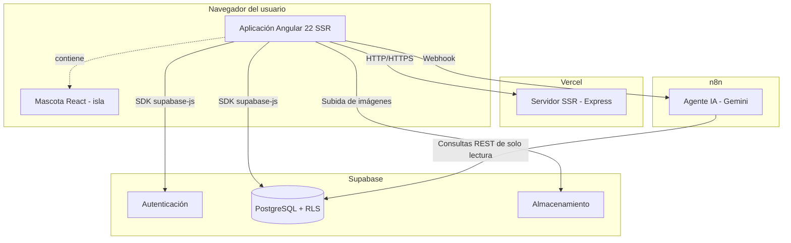
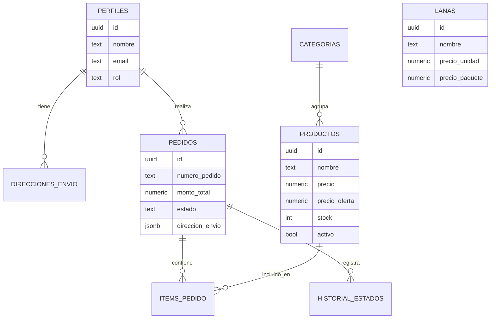
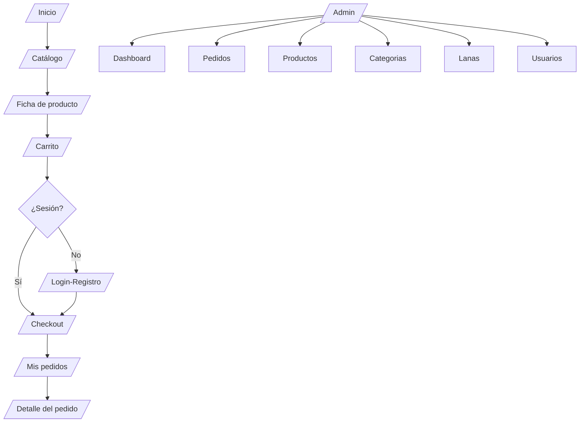
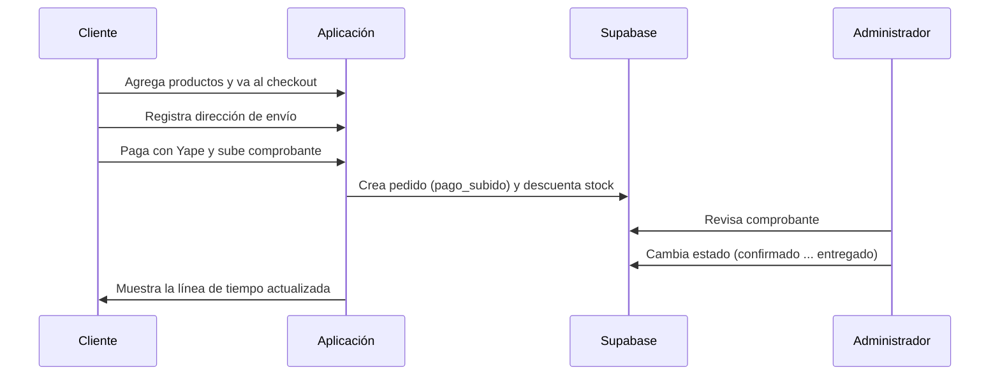

# Documentación Técnica del Sistema

## 1. Descripción del sistema

Akitukuymi es una aplicación web de comercio electrónico desarrollada para una tienda artesanal de tejidos hechos a mano ubicada en Pacucha, Andahuaylas (Apurímac, Perú). El sistema permite a los clientes explorar un catálogo, gestionar un carrito de compras, realizar pedidos con pago mediante Yape y dar seguimiento a sus compras; y a los administradores, gestionar el catálogo, verificar pagos y administrar pedidos y usuarios. Adicionalmente, integra un asistente virtual conversacional que responde consultas con información real de la base de datos.

El sistema es una migración de una versión anterior del negocio hacia un stack moderno, priorizando la velocidad de carga, la seguridad de los datos y una identidad visual propia de marca artesanal.

## 2. Arquitectura general

La solución se compone de un frontend con renderizado del lado del servidor, un backend gestionado (Supabase) y un servicio externo de automatización para el asistente virtual (n8n con el modelo Gemini). El alojamiento de producción se realiza en Vercel.



*Figura 14. Arquitectura general del sistema. [INSERTAR RENDER del diagrama Mermaid]. Fuente: Elaboración propia.*

## 3. Tecnologías utilizadas

**Tabla 6**

*Stack tecnológico del proyecto*

| Capa | Tecnología | Versión declarada | Función |
|------|-----------|-------------------|---------|
| Frontend | Angular | ^22.0.0 | Framework de la aplicación (standalone, signals, SSR). |
| Lenguaje | TypeScript | ~6.0.2 | Lenguaje de desarrollo tipado. |
| Estilos | Tailwind CSS | ^4.1.12 | Sistema de utilidades de estilo. |
| Íconos | lucide-angular | ^1.0.0 | Íconos de interfaz. |
| Íconos | @ng-icons (Tabler, Heroicons) | ^34.0.0 | Logotipos de marcas y complementos. |
| Tipografías | @fontsource-variable (Outfit, Fraunces) | ^5.2.x | Fuentes autoalojadas. |
| Backend | @supabase/supabase-js | ^2.110.3 | Autenticación, base de datos y almacenamiento. |
| Servidor SSR | Express | ^5.1.0 | Servidor de renderizado. |
| Mascota | React / react-dom | ^19.2.7 | Componente de la mascota (isla React). |
| Mascota | framer-motion | ^12.42.2 | Animación de la mascota. |
| Gestor de paquetes | pnpm | 10.15.0 | Instalación de dependencias. |

*Nota.* Las versiones corresponden a las declaradas en el archivo `package.json` del proyecto. Elaboración propia.

## 4. Estructura del proyecto

El código fuente se organiza bajo `src/app` siguiendo una separación por responsabilidades: núcleo (`core`), componentes compartidos (`shared`) y funcionalidades por página (`features`).

```
src/app/
├── core/
│   ├── models/        Interfaces de datos (producto, pedido, perfil, etc.)
│   ├── services/      Lógica de negocio y comunicación con Supabase
│   ├── guards/        Controles de acceso a rutas
│   └── solo-lectura.ts  Bloqueo de escritura en modo demostración
├── shared/
│   ├── components/    Navbar, footer, tarjeta de producto, toasts, etc.
│   └── mascota/       Mascota (isla React) y su envoltorio Angular
└── features/
    ├── home/ catalogo/ carrito/ checkout/ auth/ cuenta/ layout/
    └── admin/         Panel de administración
```

## 5. Modelo de datos

El modelo de datos se compone de ocho entidades principales. La siguiente figura muestra sus relaciones esenciales.



*Figura 15. Modelo entidad-relación simplificado. [INSERTAR RENDER del diagrama Mermaid]. Fuente: Elaboración propia.*

## 6. Capa de servicios

La comunicación con el backend se encapsula en servicios de Angular (`providedIn: 'root'`). Cada servicio expone métodos de lectura y escritura, y contempla el *modo demo* cuando no hay conexión a Supabase.

**Tabla 7**

*Servicios principales del sistema*

| Servicio | Responsabilidad |
|----------|-----------------|
| `SupabaseService` | Inicializa el cliente de Supabase y determina si el backend está habilitado. |
| `AuthService` | Registro, inicio de sesión, sesión activa, perfil y rol del usuario. |
| `ProductoService` | Consulta y gestión de productos, y subida de imágenes. |
| `CategoriaService` | Gestión de categorías. |
| `LanaService` | Gestión de lanas e hilos. |
| `PedidoService` | Creación de pedidos, subida de comprobantes y cambios de estado. |
| `DireccionService` | Direcciones de envío del cliente. |
| `CarritoService` | Estado del carrito (con persistencia local). |
| `ChatbotService` | Comunicación con el webhook del asistente virtual. |
| `UsuarioService` | Consulta de usuarios y cambio de rol (administración). |
| `ToastService` / `ConfirmacionService` | Notificaciones y diálogos de confirmación. |
| `DemoDbService` | Datos locales de muestra para el modo demo. |

*Nota.* El indicador `habilitado` del `SupabaseService` se calcula a partir de la presencia de la URL y la llave en la configuración del entorno. Elaboración propia.

## 7. Enrutamiento y control de acceso

Todas las páginas se cargan mediante *lazy loading* con `loadComponent`. Las rutas se agrupan en un layout público y un layout de administración. El control de acceso se implementa con tres guardias funcionales.

**Tabla 8**

*Guardias de ruta*

| Guardia | Regla |
|---------|-------|
| `authGuard` | Exige sesión iniciada; de lo contrario redirige a `/login` conservando el destino. |
| `adminGuard` | Exige rol de administrador; de lo contrario redirige al inicio. |
| `guestGuard` | Permite el acceso solo a visitantes sin sesión (login y registro). |

*Nota.* Las rutas `checkout`, `mis-pedidos`, `perfil` requieren `authGuard`; el conjunto `/admin` requiere `authGuard` y `adminGuard`. Elaboración propia.



*Figura 16. Mapa de navegación del sistema. [INSERTAR RENDER del diagrama Mermaid]. Fuente: Elaboración propia.*

## 8. Flujo de funcionamiento del pedido

El proceso central del sistema es la compra con pago mediante Yape y verificación manual por parte del administrador.



*Figura 17. Flujo del proceso de pedido. [INSERTAR RENDER del diagrama Mermaid]. Fuente: Elaboración propia.*

## 9. Estados del pedido

El pedido transita por una secuencia de estados definida en el modelo `EstadoPedido`. El flujo natural es: pago_pendiente, pago_subido, confirmado, empaquetado, en_camino y entregado; adicionalmente existe el estado cancelado. Cada estado tiene una etiqueta, una descripción y un estilo visual asociados en la constante `ESTADOS_PEDIDO`.

## 10. Integraciones

### 10.1. Supabase

Provee autenticación (correo/contraseña y Google), base de datos PostgreSQL con seguridad a nivel de fila (RLS) y almacenamiento de imágenes y comprobantes. La seguridad de los datos no depende de ocultar el frontend, sino de las políticas RLS del servidor, que limitan a cada usuario a sus propios datos y reservan la gestión al rol administrador.

### 10.2. Asistente virtual (n8n + Gemini)

El asistente "Akita" se implementa como un flujo de n8n compuesto por un nodo de recepción de chat, un agente de IA con el modelo Gemini, memoria por sesión y tres herramientas de consulta de solo lectura sobre la base de datos (productos, lanas y estado de pedidos por número). La aplicación se comunica con el flujo mediante un webhook configurado en el entorno. El componente cliente envía el identificador de sesión, el mensaje y metadatos del usuario, y recibe la respuesta del agente. Las herramientas utilizan la llave pública, por lo que operan bajo las mismas restricciones RLS que el resto del sistema; el asistente no expone datos de otros usuarios ni realiza operaciones de escritura.

### 10.3. Mascota (isla React)

La identidad visual del asistente es una mascota construida como componente React con Framer Motion. Dado que la aplicación principal es Angular, la mascota se monta como una *isla React*: un envoltorio Angular (`<app-mascota>`) carga React de forma diferida y únicamente en el navegador, sin afectar el renderizado del servidor ni el paquete inicial. La mascota reacciona a los estados del chat (reposo, atención, espera y conversación).

## 11. Renderizado y rendimiento

La aplicación utiliza renderizado del lado del servidor con hidratación en el cliente. La página de inicio se renderiza en el servidor en cada visita para mostrar datos actualizados; las páginas de inicio de sesión y registro se prerenderizan; el resto se renderiza en el cliente. La carga diferida de cada página, el uso de tipografías autoalojadas, la optimización de imágenes y el uso de transiciones CSS contribuyen a un primer render liviano.

## 12. Decisiones técnicas relevantes

- **Modo demo y modo real unificados:** cada servicio contempla ambos caminos (datos locales o Supabase), lo que permite desarrollar y demostrar la aplicación sin backend y activar el backend real sin modificar los componentes.
- **Modo demostración de solo lectura:** control por configuración (`soloLectura`) reforzado con un script SQL, para compartir la plataforma sin riesgo de alteración de datos.
- **Seguridad centrada en el servidor:** el uso de la llave pública en el navegador es seguro porque la protección efectiva reside en las políticas RLS.
- **Integración de la mascota como isla:** preserva la implementación original en React sin migrar toda la aplicación, minimizando el impacto en el rendimiento mediante carga diferida.

## 13. Estado actual y pendientes

El sistema se encuentra desplegado y operativo en `https://akitukuymi.vercel.app`, con catálogo, carrito, checkout, panel de administración y asistente virtual funcionando con datos reales. Se identifican como pendientes de mejora, no implementados a la fecha de este documento: la configuración de un proveedor SMTP propio para el correo transaccional, el reforzamiento de credenciales de administrador previo a la difusión pública y la eventual migración de la instancia de n8n a un alojamiento permanente.

## 14. Referencias

Angular. (2024). *Angular documentation*. https://angular.dev

Microsoft. (2024). *TypeScript documentation*. https://www.typescriptlang.org/docs

Tailwind Labs. (2024). *Tailwind CSS documentation*. https://tailwindcss.com/docs

Supabase. (2024). *Supabase documentation*. https://supabase.com/docs

Meta Open Source. (2024). *React documentation*. https://react.dev

Motion. (2024). *Framer Motion documentation*. https://www.framer.com/motion

n8n. (2024). *n8n documentation*. https://docs.n8n.io

Vercel. (2024). *Vercel documentation*. https://vercel.com/docs

pnpm. (2024). *pnpm documentation*. https://pnpm.io
